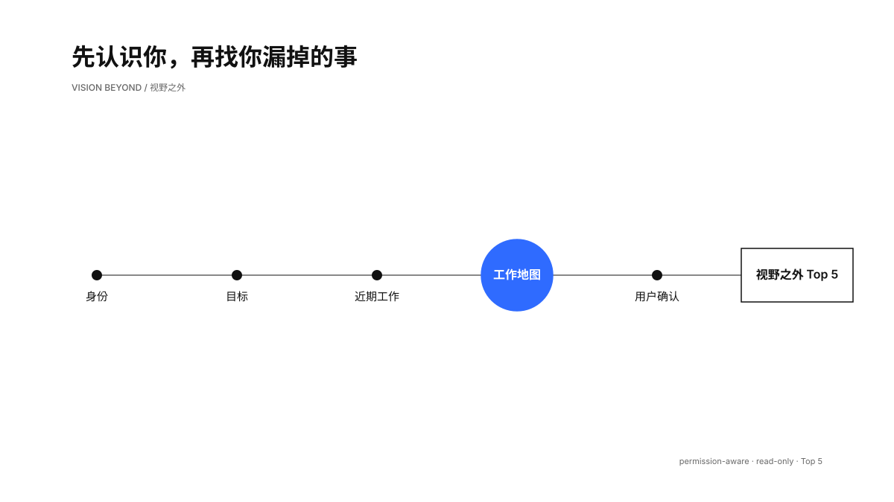
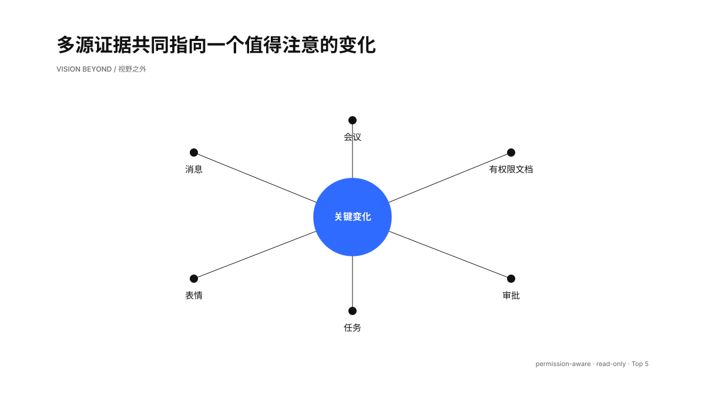
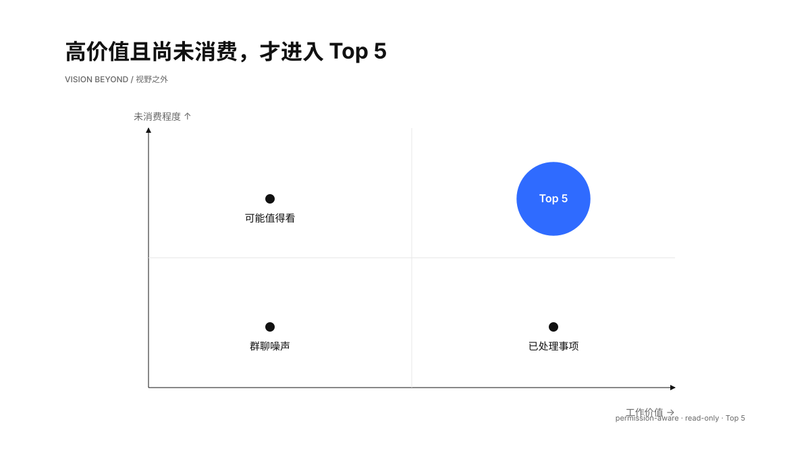
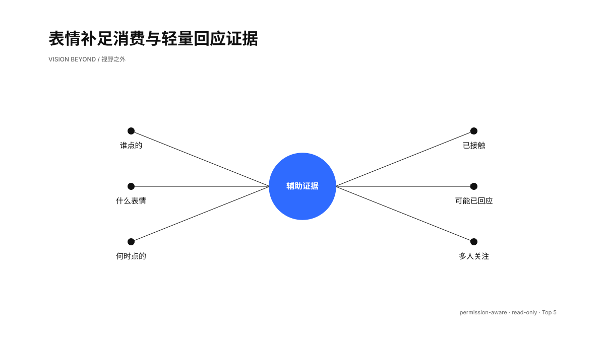

# 视野之外 / Vision Beyond

每天从飞书里找回 5 条可能改变你判断或行动、但尚未被你充分消费的信息。

它先用身份、OKR、审批、任务和近期活动生成一张“工作地图”，交给用户确认；随后在消息、会议、纪要和有权限文档中做议题驱动的检索、交叉验证与排序。第一次回看 7 天，之后按用户自己的时间和时区每日巡检。

> “built for humans and AI Agents.” — [Lark/Feishu CLI](https://github.com/larksuite/cli)



## 它解决什么

真正容易漏掉的，常常是四类信息：看到了但没有回应、没有参加却已形成结论、文档更新后没有再打开、审批或任务仍在等待动作。

“视野之外”把这些信号放到同一张工作地图里，只保留跨来源 Top 5：

- 消息：可能未读、明确待回复、轻量表情回应、线程是否闭环；
- 会议：参会事实、纪要入口、新决策、风险与待办；
- 文档：当前用户可发现、更新后可能未看、与已确认议题的关系；
- 审批与任务：待办审批、未读知会、仍有效的责任和截止时间；
- 表情：谁在何时点了什么表情，用作消费、轻量回应和群体关注的辅助证据。



## 安装

前置条件：Node.js、Python 3.10+、一个支持 Agent Skills 的 AI Agent，以及可用的飞书/Lark 自建应用。

```bash
# 1. 安装官方飞书 CLI
npx @larksuite/cli@latest install

# 2. 安装官方 lark-* Skills
npx skills add larksuite/cli -g -y

# 3. 安装“视野之外”
npx skills add TongyiDai/vision-beyond --skill vision-beyond -g -y
```

首次配置飞书 CLI：

```bash
lark-cli config init --new
lark-cli auth login --recommend
lark-cli auth status --json --verify
```

授权过程可能需要在浏览器中完成。请遵循当前 `lark-shared` Skill 给出的 split-flow 和二维码步骤；不要把授权链接或 device code 发到 Issue、日志或截图里。

## 第一次怎么用

在 Agent 中说：

```text
使用 vision-beyond。先检查我的飞书身份和权限，结合 OKR、审批、任务和最近 14 天活动生成工作地图草案，让我确认；确认后执行最近 7 天基线。每天的报告时间和时区由我来定。
```

第一次会经历两步：

1. 工作地图确认：Skill 给出 5–8 个议题草案，用户保留、删除、合并或补充。
2. 7 天基线：只在工作地图确认后执行，正式结果最多 5 条。

后续每日窗口从上一次成功运行点延续。周期任务由 Agent 宿主创建；宿主没有自动任务能力时，Skill 会给出手动运行方式。

## 输出长什么样

```text
视野之外｜2026-08-11 17:30 → 2026-08-12 17:30

1. 【高｜已接触｜已确认待回复】客户方案的交付时间被提前
   与你有关：你是交付负责人，消息和文档更新相互印证
   建议动作：今天回复新时间是否可承诺
   证据：消息链接；方案文档链接
   置信度：高

...最多 5 条

覆盖说明：消息、文档、审批已覆盖；OKR 缺权限；会议纪要有 1 条无法读取
```

分类说明、统计和摘要只引用这 5 条，不会在报告后半段继续塞入新候选。



## 表情如何参与判断

官方 CLI 的消息读取结果可以附加 reaction 明细与聚合计数。Skill 会识别当前用户发出的表情、动作时间和类型。

- 任意用户 reaction：证明用户至少接触过该消息，不能证明理解全文；
- `DONE`、`OnIt`、`CheckMark` 等：在简单、单一请求中可能构成轻量回应；
- 多人同类 reaction：只提供弱关注信号，排序加分最多 5 分；
- 负向或困惑 reaction：提示可能存在分歧，不能推断真实情绪或人际关系；
- 没有 reaction：不构成未读或未回证据。

广泛检索阶段关闭 reaction enrichment，初排前 20 条再批量补充，兼顾信息质量和请求成本。



## 证据边界

检索按当前用户权限和已确认议题展开，也不会声称扫描了用户“全部未读内容”。

- 飞书消息搜索目前没有通用的当前用户未读过滤器；
- Drive 搜索可证明当前身份在该查询下能发现对象，无法证明覆盖全部权限范围；
- 没有打开记录只能支持“可能未看”，无法普遍支持“从未打开”；
- 用户 reaction 能支持“接触过”，复杂请求仍需正文回复或任务状态闭环；
- 会议未出现在日历中，无法直接证明用户没有参加；
- 缺权限、分页截断和产物不可见都会出现在报告的覆盖说明里。

判定规则在 [`skills/vision-beyond/references`](skills/vision-beyond/references/) 中。

## 隐私与安全

第一版严格只读。Skill 不会发送消息、标记已读、编辑文档、修改日历、创建任务或处理审批。

默认私有状态位于 `~/.codex/vision-beyond/state.json`，只保存：

- 报告时间、时区和 7 天基线配置；
- 用户确认的议题、排除词和来源偏好；
- 上次成功运行点；
- 最多 2000 个不可逆 SHA-256 候选指纹。

消息正文、人员标识、reaction 明细、文档 token、会议 ID、审批实例号和授权材料不会进入状态或仓库。状态脚本以 `0600` 写入文件，并拒绝常见飞书标识、URL 和认证材料。

## 自检与测试

```bash
# 查看当前飞书能力；输出会隐藏姓名、用户 ID 和完整 scope 列表
python3 skills/vision-beyond/scripts/doctor.py

# 验证 Skill 结构
python3 /path/to/skill-creator/scripts/quick_validate.py skills/vision-beyond

# 运行无真实业务数据测试
python3 -m unittest discover -s tests -v
```

测试覆盖最小状态、私有文件权限、身份输出脱敏、reaction 能力分离和公开仓库凭证扫描。

## 设计取舍

- 基于官方 [`larksuite/cli`](https://github.com/larksuite/cli) 读取飞书，不维护第二套 API 客户端；
- 借鉴社区聊天摘要工作流的多源编排，增加工作地图确认、审批、消费状态和证据纪律；
- 排序目标是减少关键事实流失，消息数量、群规模和发送者职级不充当单独价值指标；
- 每日结果固定为总 Top 5，高价值候选不足时保持少于 5 条。

当前未发现直接覆盖“身份/OKR → 用户确认 → 消息/会议/文档/审批 → 权限感知 Top 5”的开源飞书 Skill。相关方案和官方底座见 [larksuite/cli](https://github.com/larksuite/cli)、[lark-workflow-feishu-cli](https://github.com/liangdabiao/lark-workflow-feishu-cli) 与 [skills CLI](https://github.com/antfu/skills-cli)。

## 仓库结构

```text
skills/vision-beyond/
├── SKILL.md
├── agents/openai.yaml
├── references/
└── scripts/
    ├── doctor.py
    └── state.py

assets/boards/      README 画板及 Scene JSON
tests/              无真实飞书数据的单元测试与隐私扫描
tools/              确定性画板渲染器
```

## 参与贡献

欢迎提交 Issue 或 PR，优先关注：不同租户的权限差异、阅读状态证据、跨来源去重、表情语义误判、调度宿主兼容和脱敏测试。

请勿上传真实聊天正文、截图、人员标识、文档链接、审批实例、会议 ID、app ID、token 或授权 URL。安全问题请使用 GitHub Security Advisory，细则见 [SECURITY.md](SECURITY.md)。

## License

[MIT](LICENSE)
